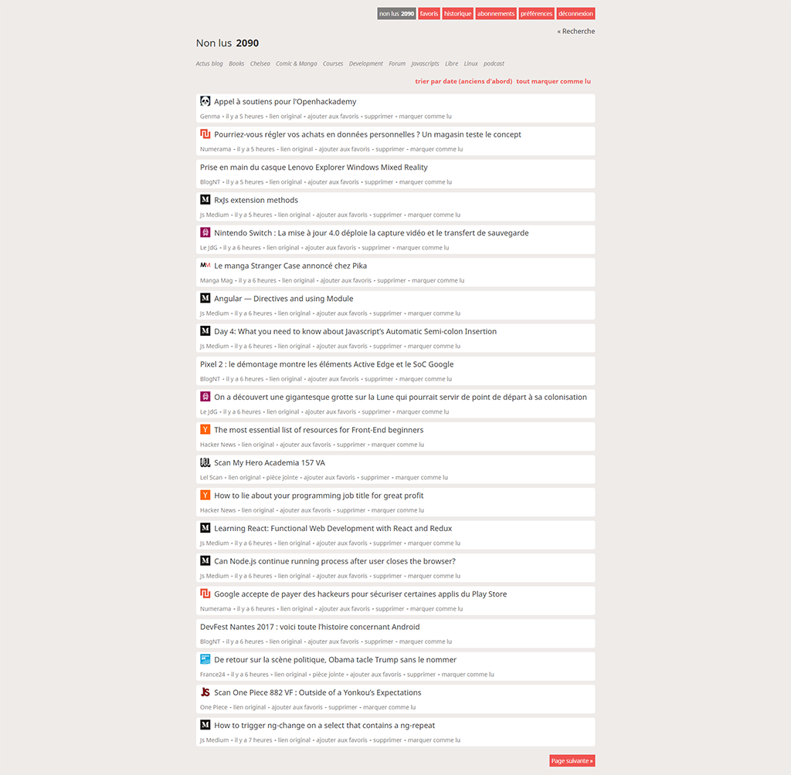

# Yonta-Fork (until I find a better name)

A pretty theme for [Miniflux](https://miniflux.net/) (v1.x), based on the [Yonta](https://github.com/meradoou/yonta) theme by [meradoou](https://github.com/meradoou).

## Features
- Responsive design
- OS native fonts for text
- Webfont icons via [IcoMoon](https://icomoon.io/) ([Entypo+](http://www.entypo.com/), [Material Icons](https://material.io/icons/))

## Compatibility
Tested with Miniflux v1.2.3 and the following setups:

- Firefox 55.x
- macOS 10.13+ / Safari 11+
- iOS 11.1+ / Safari 11+
- Android 6 / Chrome 62

## Screenshots

## License

Yonta-forks code (all files, except fonts) is distributed under MIT license. See
[LICENSE](https://github.com/JanJastrow/yonta-fork/blob/master/LICENSE) file for details.

Embedded fonts are distributed under their primary licenses (Apache License 2.0 / CC BY-SA).